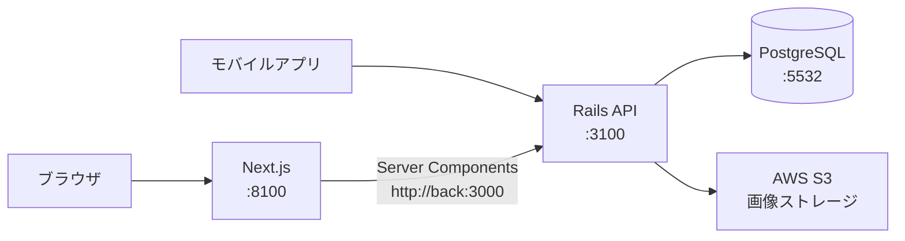
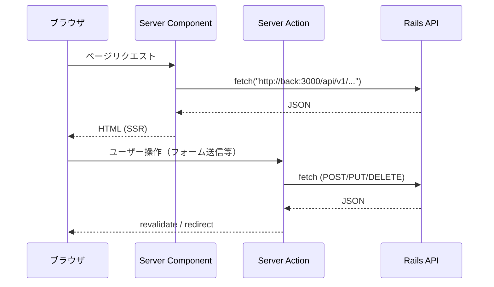

# BUZZ BASE フロントエンド

野球の個人成績をランキング形式で共有するWebアプリのフロントエンド。Next.js 16 (App Router) + React 19 + TypeScript で構築。

## アーキテクチャ

### システム全体図



> ポート番号はホスト側。コンテナ内は front:4100, back:3000, db:5432

### データフロー



### ディレクトリ構成

```
app/
├── (app)/                # メインアプリのルートグループ
│   ├── dashboard/        # ダッシュボード
│   ├── mypage/           # マイページ・プロフィール
│   ├── users/            # ユーザー詳細
│   ├── groups/           # グループ機能
│   ├── game-result/      # 試合結果記録・詳細
│   ├── seasons/          # シーズン管理
│   ├── note/             # 野球ノート
│   ├── signin/           # ログイン
│   ├── signup/           # 新規登録
│   └── _components/      # (app)レイアウト共通コンポーネント
├── (admin)/              # 管理画面（別レイアウト）
│   ├── admin/
│   │   ├── auth/
│   │   ├── dashboard/
│   │   └── users/
│   └── _components/
├── constants/            # API URL等の定数
├── contexts/             # React Context
├── types/                # TypeScript型定義
└── utils/                # ユーティリティ関数
components/               # 画面横断の共通コンポーネント
lib/                      # サーバーサイドユーティリティ（JWT, Admin認証）
public/                   # 静的ファイル（アイコン, OGP画像）
```

## 設計パターン

### Server Component優先

全ページはデフォルトでServer Componentとして実装する。Client Component（`"use client"`）はイベントハンドリングや状態管理が必要な場合のみ使用する。

### Server Actions

APIリクエストはServer Actionsで実行する。`useEffect` でのデータ取得は禁止。各ルートディレクトリ内の `actions.ts` にServer Actionを配置する。

### Container / Presentational パターン

- **Container**: データ取得・ビジネスロジック（Server Component）
- **Presentational**: UIの表示のみ（props経由でデータを受け取る）

### ルーティング規約

- `_components/` — ルーティングに関係しないディレクトリ（先頭にアンダースコア）
- `(app)/`, `(admin)/` — レイアウトグループ
- `page.tsx` にはルートコンポーネントのみ記載し、UIは `_components/` に分離

## 開発環境のセットアップ

### 前提条件

- Docker / Docker Compose

### 手順

```bash
# 1. ルートリポジトリをクローン（サブモジュール含む）
git clone --recurse-submodules git@github.com:ippei-shimizu/buzzbase.git
cd buzzbase

# 2. 全サービス起動
docker compose up

# 3. 動作確認
# ブラウザで http://localhost:8100 を開く
```

### フロントエンド単体での開発

```bash
cd front
yarn install
yarn dev    # http://localhost:4100
```

## 開発コマンド

| コマンド         | 説明                 |
| ---------------- | -------------------- |
| `yarn dev`       | 開発サーバー起動     |
| `yarn build`     | 本番ビルド           |
| `yarn lint`      | ESLint実行           |
| `yarn typecheck` | TypeScript型チェック |
| `yarn test`      | テスト実行           |
| `yarn format`    | Prettier整形         |

## 環境変数

| 変数名                         | 説明                        | 開発環境デフォルト             |
| ------------------------------ | --------------------------- | ------------------------------ |
| `RAILS_API_URL`                | バックエンドAPI URL         | `http://back:3000`（Docker内） |
| `NEXT_PUBLIC_GOOGLE_CLIENT_ID` | Google OAuth クライアントID | —                              |
| `SENTRY_DSN`                   | Sentry DSN                  | —                              |
| `ADSENSE_ENABLED`              | AdSense有効化               | `false`                        |

## テスト

```bash
yarn test           # 全テスト実行
yarn test:watch     # ウォッチモード
yarn test:coverage  # カバレッジ付き
```

- Jest + React Testing Library
- テストファイルは対象ファイルと同じディレクトリに `*.test.ts(x)` で配置

## 関連リポジトリ

| リポジトリ                                                          | 説明                                |
| ------------------------------------------------------------------- | ----------------------------------- |
| [buzzbase](https://github.com/ippei-shimizu/buzzbase)               | ルートリポジトリ（モノレポ）        |
| [buzzbase_back](https://github.com/ippei-shimizu/buzzbase_back)     | バックエンド（Rails API）           |
| [buzzbase_mobile](https://github.com/ippei-shimizu/buzzbase_mobile) | モバイルアプリ（Expo/React Native） |
